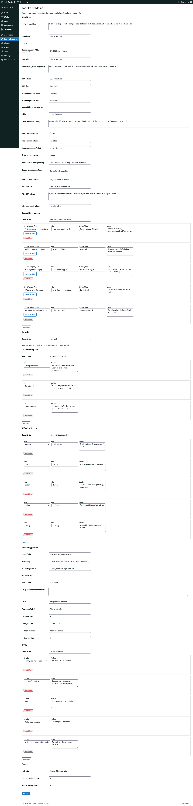
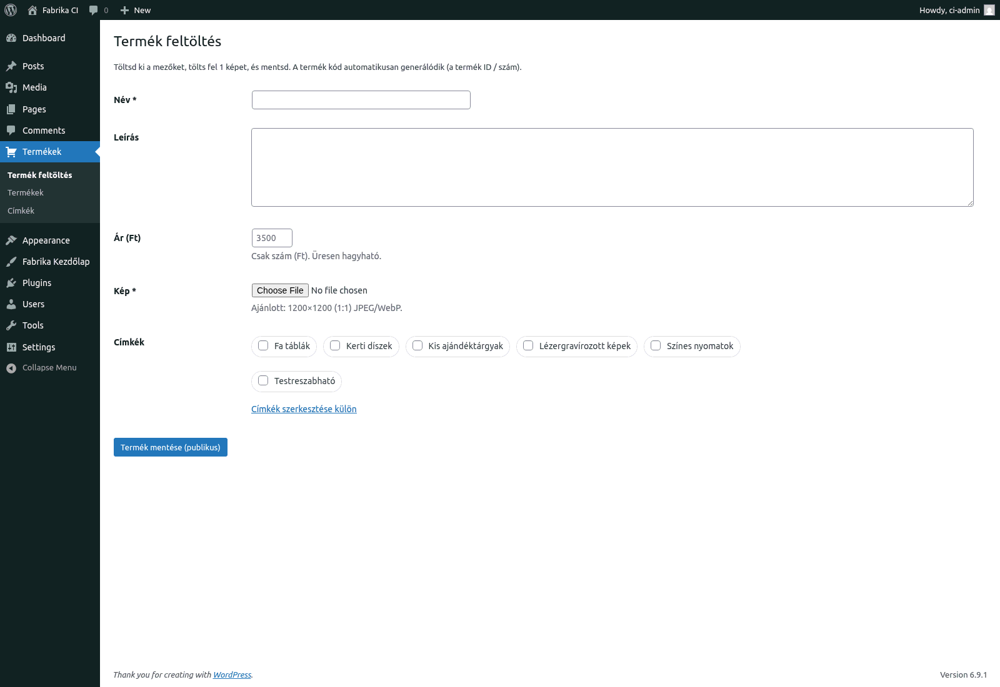
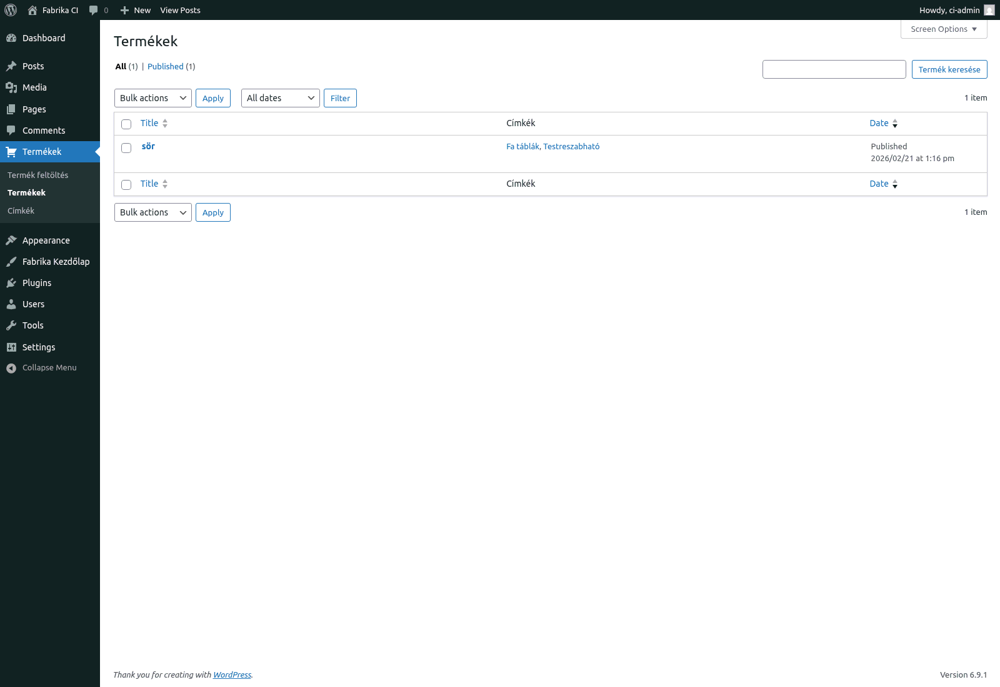

# Fabrika Ajándék

Kézműves fa ajándékokhoz készült landing page variációk és a kiválasztott dizájnból épített, telepíthető WordPress téma.

## Mi van ebben a repóban?

- **9 statikus landing oldal variáció** (`1/` - `9/`) - ugyanarra a márkára több vizuális irány (Tailwind + Vite).
- **`6-2/`** - a kiválasztott dizájn, egylapos felépítéssel (hero, termékkategóriák, galéria, rendelési lépések, ajándékötletek, piaci jelenlét, kapcsolat, GYIK).
- **`wp-content/themes/fabrika-62/`** - a WordPress téma, ami a `6-2` dizájnt valósítja meg adminból szerkeszthető tartalommal.
- **`tests/`** - Playwright vizuális regresszió + PHP repeater terheléses tesztek.
- **`feladatok/`** - projektleírások és roadmap.

## Statikus oldalak futtatása

```bash
npm install
npm run dev
```

Ezután a fő index: `http://localhost:5173/`, vagy közvetlenül bármelyik variáció:

- `http://localhost:5173/1/`
- `http://localhost:5173/2/`
- ...
- `http://localhost:5173/6-2/`

## WordPress futtatása lokálisan

Előfeltétel: Docker + Docker Compose.

```bash
docker compose up -d
```

| Szolgáltatás | URL |
|---|---|
| WordPress | http://localhost:8080 |
| WP Admin | http://localhost:8080/wp-admin/ |
| MailHog | http://localhost:8025 |

Első indításkor végig kell menni a WP telepítőn (`/wp-admin/install.php`), majd aktiválni a **fabrika-62** témát.

A téma mappa bind mounttal csatolva van, ezért a `wp-content/themes/fabrika-62/` alatti módosítások azonnal látszanak.

### Tartalom szerkesztése

A nyitóoldal tartalma egy helyen kezelhető:
**WP Admin -> Fabrika Kezdolap**.

Itt szerkeszthetők a szövegek, repeaterek (kategóriák/galéria/lépések/ajándékötletek/GYIK), valamint a kapcsolat blokk beállításai.
Részletes útmutató: [`feladatok/admin-hasznalati-leiras.md`](feladatok/admin-hasznalati-leiras.md)

### WPForms gyors setup (lokál minta)

Ha újrahúzod a lokál WP-t, ezzel a scriptel egy lépésben beállítható a kapcsolat űrlap:

```bash
bash scripts/setup-wpforms.sh
```

Mit állít be:
- létrehoz/frissít egy magyar WPForms kapcsolat űrlapot,
- bekapcsolja az AJAX beküldést,
- magyar sikerüzenetet állít be,
- a theme optionben beállítja a shortcode-ot.

Ellenőrzés:
- `http://localhost:8080/?nocache=1#kapcsolat`

Smoke teszt (Playwright):

```bash
npm run smoke:contact
```

Ez ellenőrzi:
- kontakt szekció + WPForms jelenlét,
- `?termek=` előtöltés működés,
- AJAX submit (ne legyen teljes oldalletöltés beküldéskor).

## Beállítás képekkel (gyors útmutató)

### 1. Kezdőoldal tartalmának beállítása

Menü: **WP Admin -> Fabrika Kezdolap**  
Itt tudod szerkeszteni a fő szekciókat (hero, kategóriák, galéria, lépések, kapcsolat, GYIK).



### 2. Új termék feltöltése

Menü: **WP Admin -> Termékek -> Termék feltöltés**  
Kötelező mezők: név + kép.  
Ajánlott még: ár és címkék.



### 3. Kategóriák/címkék kezelése

Menü: **WP Admin -> Termékek -> Címkék**  
Itt hozhatod létre és szerkesztheted a termékcímkéket (sluggal együtt).  
Ezek jelennek meg szűrőként a katalógus oldalon.


### 4. Terméklista ellenőrzése

Menü: **WP Admin -> Termékek**  
Itt látod a feltöltött tételeket, és innen tudod szerkeszteni/ellenőrizni őket.



### Kapcsolati űrlap (WPForms) beállítás

A kapcsolat szekcióban most WPForms shortcode fut (`[wpforms id="..."]`).

Menü:
- **WP Admin -> WPForms -> All Forms -> kiválasztott form -> Edit**

Javasolt mezők (magyar):
- `Név` (kötelező), placeholder: `A neved`
- `E-mail` (kötelező), placeholder: `pelda@email.com`
- `Tárgy`, placeholder: `Miben segíthetünk?`
- `Üzenet`, placeholder: `Írd le az elképzelésed...`

Submit gomb:
- `Üzenet küldése`

Ha nem ugyanaz látszik, mint lokálban:
1. Ellenőrizd a shortcode-ot: **WP Admin -> Fabrika Kezdolap -> Űrlap shortcode** (`[wpforms id="94"]` vagy a saját form ID).
2. Mentsd a formot a WPForms builderben.
3. Futtass cache purge-ot (lásd lent).

### Email tesztelés

Lokálban a WordPress kimenő levelei MailHogba mennek:
`http://localhost:8025`

## Tesztek futtatása

**E2E (statikus mock `6-3/`)**:

```bash
npx playwright install chromium
npm test
```

**Vizuális regresszió** (`6-2` statikus vs WordPress kimenet):

```bash
npm run dev -- --port 3999 &   # statikus referencia
docker compose up -d            # WordPress
node tests/visual-regression.mjs
# Képek: tests/screenshots/
```

**Repeater stressz teszt** (0/1/2/3/5/10 elem + hosszú szöveg):

```bash
docker cp tests/stress-test-repeaters.php fabrika_wp_app:/tmp/
docker exec fabrika_wp_app php /tmp/stress-test-repeaters.php
```

## Éles telepítés (téma export és feltöltés)

### 1. ZIP előállítása

```bash
bash scripts/export-theme.sh
```

Ez alapból **lean** export:
- a mock galéria/kategória képek kimaradnak,
- kisebb lesz a ZIP (könnyebb feltöltés limitált tárhelyen).

Ha a teljes mock referencia készlet is kell:

```bash
bash scripts/export-theme.sh --full
```

A script a `dist/` mappába generál:

| Fájl | Tartalom |
|---|---|
| `dist/fabrika-62-theme.zip` | Telepíthető WordPress téma |
| `dist/fabrika62_options.json` | Aktuális admin beállítások (ha fut a Dockeres WP) |

Megjegyzés:
- A script automatikusan kihagyja a fejlesztői fájlokat (`test-results`, `ci/`, `inc/6-2-source.html`, `.DS_Store`, stb.).
- Csomagoláskor optimalizálja a referencia képeket.
- Alapértelmezésben lean módot használ.

### 2. Telepítés a céloldalon

**A. Téma feltöltése**

WP Admin -> Megjelenés -> Témák -> Témafeltöltés -> `dist/fabrika-62-theme.zip` -> Aktiválás

Alternatíva: FTP-vel másold a `fabrika-62/` mappát a szerver `wp-content/themes/` könyvtárába, majd aktiváld.

**B. Rewrite frissítése**

WP Admin -> Beállítások -> Közvetlen hivatkozások -> Mentés

Vagy WP-CLI:

```bash
wp rewrite flush
```

**C. Cache purge (fontos)**

Ha cache plugin/CDN fut, a módosítások csak cache ürítés után látszanak biztosan.

- W3 Total Cache esetén: admin felső sáv -> **Performance -> Purge All Caches**
- Ha Cloudflare is van: Cloudflare-ben is futtasd a **Purge Cache** műveletet.

**D. Admin beállítások importálása (opcionális)**

A téma alapértékekkel is működik (`inc/helpers.php`, `fabrika62_default_options()`), import csak akkor kell, ha lokálban már testreszabtátok a tartalmakat.

```bash
# WP-CLI (ha van a szerveren)
wp option update fabrika62_options "$(cat dist/fabrika62_options.json)"
```

**E. Termékek és média**

A mock termékadatok nem kerülnek a ZIP-be (DB adat), ezeket az adminban kell létrehozni.

## Mi kerül a ZIP-be?

| Benne van | Nincs benne |
|---|---|
| PHP template fájlok | Mock/teszt termékek (DB) |
| CSS + JS assetek | `wp-content/uploads/` tartalma |
| Referencia képek (`assets/references/`) | Docker/dev konfiguráció |
| CPT + taxonómia logika | Lokális tesztfájlok |

## Technológia

- **Statikus oldalak:** Vite, Tailwind CSS 4
- **WordPress téma:** egyedi admin oldal repeaterekkel
- **Űrlap:** WPForms (shortcode alapú)
- **Lokális környezet:** Docker Compose (WordPress + MariaDB + MailHog)
- **Tesztek:** Playwright, egyedi PHP stressz teszt
